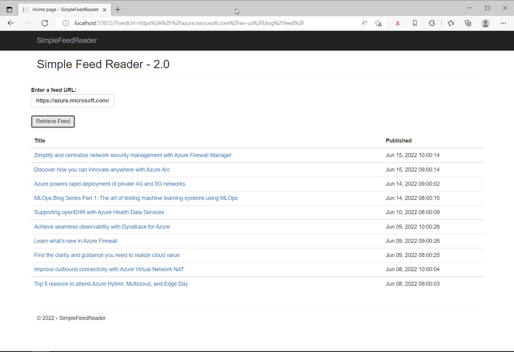

# Simple Feed Reader
  It’s a **Razor Pages** app that uses the _Microsoft.SyndicationFeed.ReaderWriter_ API to retrieve an RSS/Atom feed and display the news items in a list. 

> ### VERSIONS
> #### The `master` branch is currently running ASP.NET Core 6.0.
> #### Older versions are tagged.

